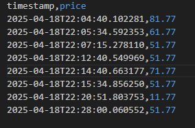
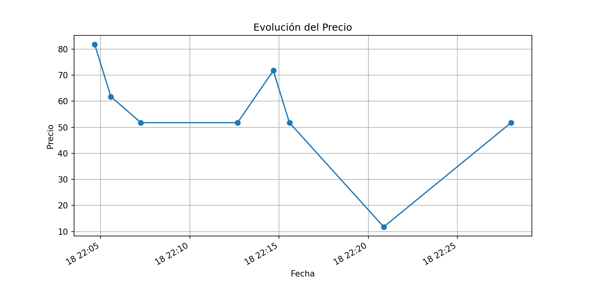

# Price Scraper 🛒

Este proyecto **scrapea** el precio de un producto desde una página web y **grafica** su evolución histórica.

---

## 📷 Capturas


```markdown



```


---

## 📁 Estructura del proyecto

```bash
price_scraper/
├── docs/
│   └── images/
│       ├── price_history_csv.png   # Ejemplo de CSV con datos
│       └── price_history.png       # Ejemplo del gráfico generado
├── price_scraper.py                # Script principal
├── requirements.txt                # Dependencias
├── price_history.csv               # Historial de precios (ignorado en Git)
└── .gitignore
```

---

## 📋 Requisitos

- Python 3.7 o superior
- Conexión a Internet

---

## ⚙️ Instalación

1. Clona el repositorio:
   ```bash
   git clone https://github.com/tu-usuario/price_scraper.git
   cd price_scraper
   ```
2. Crea y activa un entorno virtual:
   ```bash
   python -m venv venv
   # Windows PowerShell:
   Set-ExecutionPolicy -Scope CurrentUser -ExecutionPolicy RemoteSigned
   .\venv\Scripts\Activate.ps1
   # Unix/macOS:
   source venv/bin/activate
   ```
3. Instala las dependencias:
   ```bash
   pip install --upgrade pip
   pip install -r requirements.txt
   ```

---

## ▶️ Uso

Ejecuta el scraper indicando la URL del producto y el selector CSS del precio:

```bash
python price_scraper.py \
  "<URL_DEL_PRODUCTO>" \
  "<SELECTOR_CSS>" \
  --csv price_history.csv
```

**Ejemplo:**
```bash
python price_scraper.py \
  "http://books.toscrape.com/catalogue/a-light-in-the-attic_1000/index.html" \
  "p.price_color" \
  --csv price_history.csv
```

El script imprimirá el precio, lo añadirá a `price_history.csv` y generará el gráfico en `price_history.png`.

---

## 📝 Detalles

- **Scraping:** `requests` + `BeautifulSoup`.
- **Histórico:** guardado en CSV.
- **Gráfica:** `matplotlib` con backend `Agg` (sin ventana).
- **Limpieza de texto:** usa `re` para extraer sólo dígitos.

---

## 🤝 Contribuciones

¡Las contribuciones son bienvenidas! Abre un _issue_ o un _pull request_.

---

## 📝 Licencia

MIT License. Consulta el archivo `LICENSE` para más detalles.

